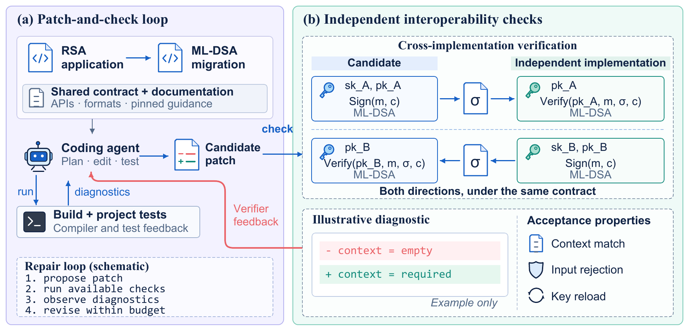

# Post-quantum code migration

Code and recorded results for *Can Coding Agents Migrate to Post-Quantum Cryptography?*

The Go application migrates a file signer from RSA to ML-DSA-44. The checker tests interoperability with OpenSSL against [the contract](task/CONTRACT.md).

[](assets/method.pdf)

Both conditions receive the contract, compiler, documentation and OpenSSL. Feedback adds optional access to the external checker. Final evaluation uses fresh inputs in both conditions.

## Results

Full passes require a successful build and all 40 checks to pass.

| Model and agent | Baseline | Feedback |
| --- | ---: | ---: |
| Qwen3-Coder-30B-A3B · mini-swe-agent · 32K | 0/20 | 0/20 |
| Qwen3.8-27B · mini-swe-agent · 128K | 18/20 | 18/20 |
| Qwen3.8-27B · mini-swe-agent · 32K | 3/20 | 1/20 |
| Nemotron 3.5 Lightning · mini-swe-agent · 128K | 0/20 | 0/20 |
| GPT-6 Astra · Codex | 1/1 | 1/1 |
| Claude Fable 5.1 · Claude Code | 1/1 | 1/1 |

Native-agent rows are single cases. Harnesses and serving settings differ across models; these rows are not a controlled model ranking. Twelve local-agent patches pass local verification while failing external requirements.

## Code

```text
cmd/         Go programs: rsa-signer and mldsa-signer
checker/     External checks and fault controls
analysis/    Python analysis and plotting
task/        Contract and experiment prompts
data/        Recorded evidence and provenance
go.mod       Go module and pinned dependencies
```

## Build and check

Use Go 1.27.1, OpenSSL 3.5.8, Python and GNU coreutils. CIRCL 1.6.5 is pinned in `go.mod`.

```sh
make build
make check
make test
```

Executables go in `bin/`. Set `GO=/path/to/go` and `OSSL=/path/to/openssl` if needed. The self-test runs trusted, deliberately faulty builds and takes several minutes; it never executes archived agent candidates.

## Reproduce the results

Python 3.12 or later; no model or GPU required:

```sh
make results
```

This checks the published measurements for all 164 scored attempts and writes `out/results.csv` and `out/results.json`. The data includes named checker outcomes, action counts, runtimes and prompt-token counts. Raw model conversations, generated candidate sources and credentials are not included. Native-agent trials are individual cases, not repeated model comparisons.

## Plot

```sh
python3 -m pip install -r analysis/requirements.txt
make figure
```

The context figure is written to `out/context.pdf`. These commands reproduce recorded results; they do not launch new agent experiments.

The evaluated sources remain frozen; `data/provenance.json` records their hashes and the release cleanup. Research code under Apache-2.0; checker acceptance is not a security certification.
